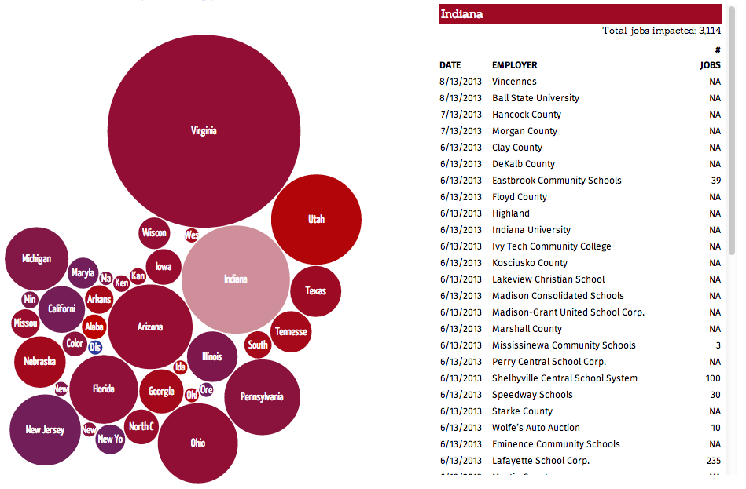

ocd3
====

Visualizing Obamacare Job Cuts With R &amp; D3

See:

- the companion blog post http://rud.is/b/2013/09/28/obamacare-jobs-r-d3/
- the actual data vis in action http://rud.is/ocd3/

Changelog

2013-09-30
- updated viz to add a selection menu that's tied to the bubbles
- alternated table row background colors
- added title text to table rows
- formatted numners in table rows
